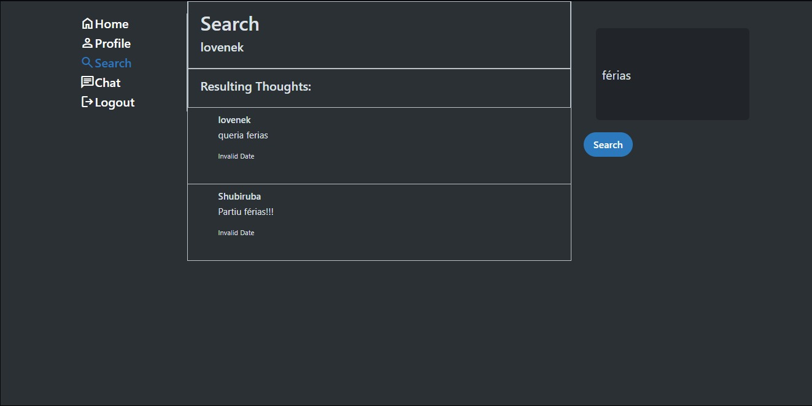
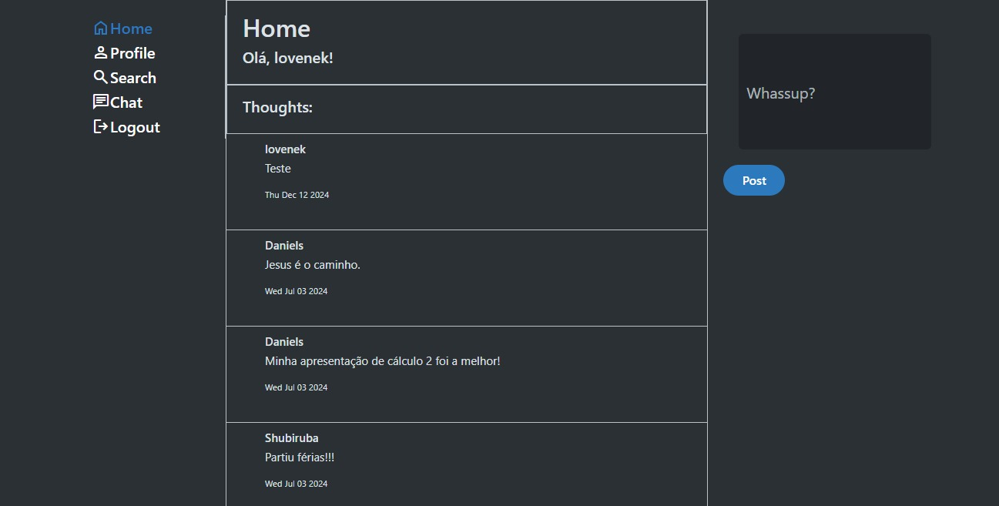
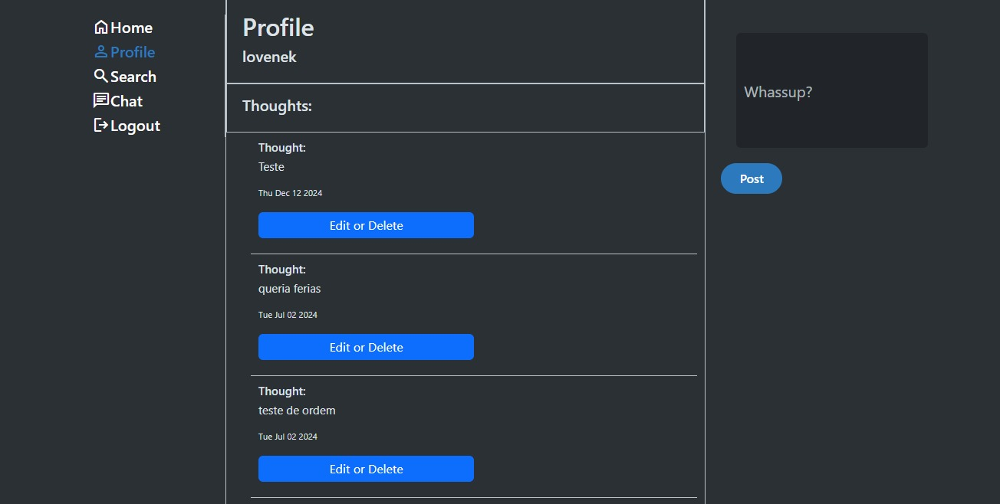
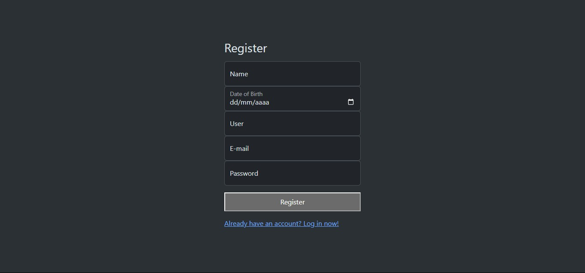
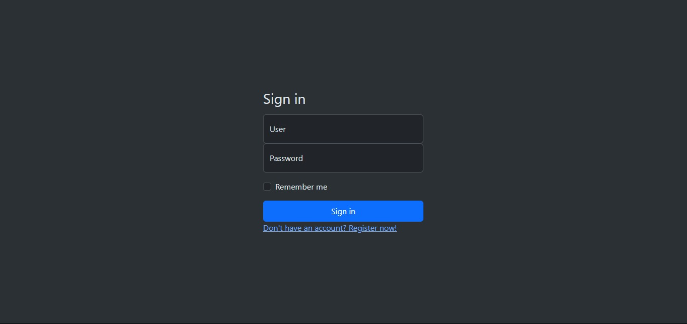
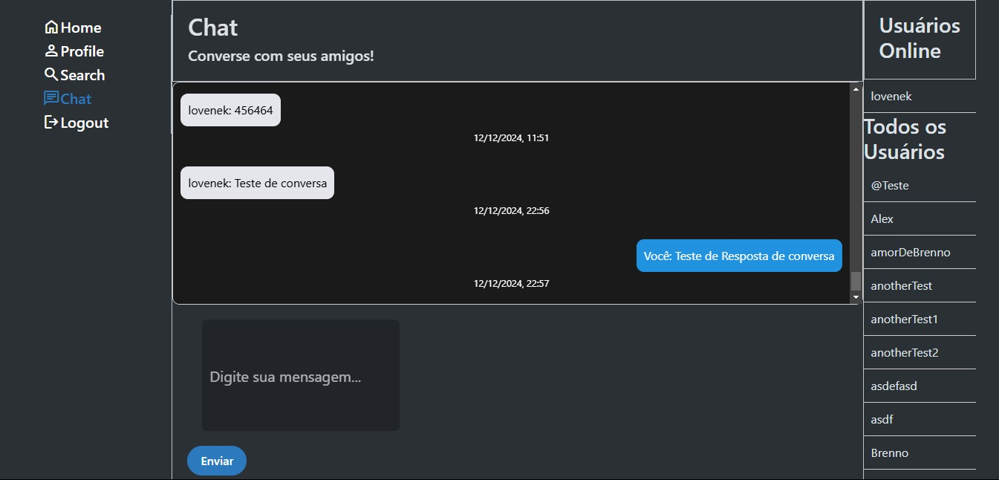

# Modelagem Conceitual

Nessa rede social, há usuários. Cada usuário é identificado por um ID numérico, possui um username único, senha para utilização da conta, além de ter a possibilidade de cadastrar diversos emails para recuperação da conta.

Cada usuário pode publicar múltiplos "Pensamentos". Para cada Pensamento, há alguns dados associados a ele, como data de publicação, conteúdo (texto), quantidade de curtidas e o ID do usuário que o publicou.

Dentro dessa rede social, um usuário pode, após publicar, alterar o conteúdo de um de seus Pensamentos, assim como excluí-lo do sistema e conversar com outro usuário. Além disso, ele pode modificar o seu username para um que ainda não esteja cadastrado na plataforma.

# Twitter Rep

Um projeto inspirado no Twitter, desenvolvido em Node.js. Este aplicativo permite que os usuários interajam por meio de postagens, implementando funcionalidades modernas com suporte a WebSocket para comunicação em tempo real.

## Requisitos para rodar o projeto

Antes de executar o projeto, certifique-se de atender aos seguintes requisitos:

1. **Node.js**  
   - Certifique-se de ter o Node.js instalado. Recomendamos a versão mais recente LTS para garantir a compatibilidade com as dependências.

2. **Gerenciador de Pacotes (npm ou yarn)**  
   - O `npm` é instalado automaticamente com o Node.js. Caso prefira usar `yarn`, instale-o separadamente.

3. **Banco de Dados MySQL**  
   - Configure um banco de dados MySQL para a aplicação.
   - O projeto utiliza a biblioteca `mysql2` para se conectar ao banco de dados.

4. **Dependências do Projeto**  
   - Execute o seguinte comando no terminal, dentro do diretório do projeto, para instalar todas as         dependências necessárias:  
     ```bash
     npm install
     ```

5. **Variáveis de Ambiente**  
   - Crie um arquivo `.env` na raiz do projeto e configure as seguintes variáveis:  
     ```env
     DB_HOST=seu_host
     DB_USER=seu_usuario
     DB_PASSWORD=sua_senha
     DB_NAME=nome_do_banco
     PORT=porta_desejada
     ```

6. **Outras Dependências Utilizadas**  
   - `dotenv`: Para carregar as variáveis de ambiente.
   - `express`: Framework de servidor web.
   - `ejs`: Para renderização de templates.
   - `express-session`: Para gerenciamento de sessões.
   - `mysql2`: Biblioteca para conexão com MySQL.
   - `ws`: Para comunicação em tempo real com WebSocket.

## Rotas da Aplicação

### 1. **/register (GET e POST)**
- **GET:** Exibe a página de registro (`register.html`).  
  - **Descrição:** Permite que o usuário visualize o formulário para criar uma nova conta.  
- **POST:** Realiza o cadastro de um novo usuário no banco de dados.  
  - **Descrição:**  
    - Insere o `username` e a `senha` na tabela `users`.  
    - Insere o `email` vinculado ao ID do usuário na tabela `emails`.  
    - Após o cadastro bem-sucedido, redireciona o usuário para a rota `/login`.

---

### 2. **/login (GET e POST)**
- **GET:** Exibe a página de login (`index.html`).  
  - **Descrição:** Permite que o usuário visualize o formulário de login.  
- **POST:** Autentica o usuário.  
  - **Descrição:**  
    - Verifica se o `username` e a `senha` fornecidos correspondem aos dados no banco de dados.  
    - Em caso de sucesso, salva os dados do usuário na sessão e redireciona para `/timeline`.  
    - Caso contrário, retorna uma mensagem de erro.

---

### 3. **/timeline (GET e POST)**
- **GET:** Exibe a página da timeline.  
  - **Descrição:** Mostra todas as postagens (pensamentos) do banco de dados em ordem decrescente, vinculadas ao nome de usuário.  
- **POST:** Permite que o usuário adicione uma nova postagem na timeline.  
  - **Descrição:**  
    - Salva o conteúdo da postagem no banco de dados, vinculando-a ao ID do usuário logado.  
    - Redireciona novamente para a timeline.

---

### 4. **/profile (GET)**
- **GET:** Exibe o perfil do usuário logado.  
  - **Descrição:** Mostra todas as postagens do usuário logado, em ordem decrescente, além do nome de usuário na sessão.

---

### 5. **/thought/:id (GET)**
- **GET:** Exibe detalhes de uma postagem específica.  
  - **Descrição:**  
    - Busca uma postagem no banco de dados usando o ID fornecido na URL.  
    - Renderiza a postagem na página.

---

### 6. **/delete/:id (POST)**
- **POST:** Deleta uma postagem específica.  
  - **Descrição:**  
    - Remove do banco de dados a postagem correspondente ao ID fornecido na URL.  
    - Redireciona o usuário para a página `/profile`.

---

### 7. **/update/:id (POST)**
- **POST:** Atualiza o conteúdo de uma postagem específica.  
  - **Descrição:**  
    - Atualiza o texto de uma postagem no banco de dados usando o ID fornecido na URL.  
    - Redireciona o usuário para a página `/profile`.

---

### 8. **/search (GET)**
- **GET:** Realiza a busca de postagens.  
  - **Descrição:**  
    - Pesquisa no banco de dados postagens cujo conteúdo contenha o texto especificado na query (`?content=`).  
    - Retorna os resultados encontrados para a página de busca.

---

### 9. **/chat (GET)**
- **GET:** Exibe a página de chat em tempo real.  
  - **Descrição:**  
    - Permite a comunicação em tempo real entre os usuários utilizando WebSocket.  
    - Redireciona para `/login` caso o usuário não esteja autenticado.

---

### 10. **/users-online (GET)**
- **GET:** Retorna uma lista de usuários online, excluindo o próprio usuário logado.  
  - **Descrição:**  
    - Consulta no banco de dados os usuários com o status `is_online = TRUE`.  
    - Retorna os resultados como um JSON.

---

### 11. **/all-users (GET)**
- **GET:** Retorna a lista de todos os usuários cadastrados no banco de dados, em ordem alfabética.  
  - **Descrição:**  
    - Realiza uma consulta na tabela `users` e retorna os IDs e nomes de usuário em formato JSON.

Segue a documentação do WebSocket para incluir no README:

---

## WebSocket: Comunicação em Tempo Real

O projeto utiliza **WebSocket** para implementar funcionalidades de comunicação em tempo real, como notificações de mensagens e atualizações de status de usuários (online/offline). Este módulo é implementado no arquivo `ws.js` e integrado ao servidor HTTP principal.

### Protocolo WebSocket
O WebSocket fornece um canal de comunicação bidirecional entre cliente e servidor. Diferentemente do HTTP, ele permite uma conexão persistente, garantindo comunicação em tempo real. A comunicação utiliza o protocolo **ws://** para conexões não seguras e **wss://** para conexões seguras.

---

### Funcionalidades Implementadas

1. **Gerenciamento de Conexões**  
   - Quando um cliente conecta, uma instância WebSocket é criada e associada ao servidor.
   - Um mapa (`clients`) é utilizado para rastrear os usuários conectados, relacionando seus IDs com as respectivas conexões WebSocket.

2. **Eventos de WebSocket**  
   - **`connection`**: Disparado quando um novo cliente conecta ao WebSocket.
   - **`message`**: Disparado quando uma mensagem é recebida de um cliente.
   - **`close`**: Disparado quando um cliente desconecta.

3. **Tipos de Mensagens Aceitas**
   - **`login`**:  
     - Atualiza o status do usuário no banco de dados para `is_online = TRUE`.
     - Rastreia o cliente conectado usando o `userId`.
   - **`start_chat`**:  
     - Verifica se existe um chat entre dois usuários. Se não, cria um novo chat no banco de dados.  
     - Retorna o histórico de mensagens do chat.
   - **`message`**:  
     - Insere a mensagem enviada no banco de dados.  
     - Envia a mensagem ao destinatário, se ele estiver online.
   - **`chat_history`**:  
     - Retorna o histórico de mensagens de um chat específico.

4. **Encerramento de Conexão (`close`)**
   - Quando o cliente desconecta, o mapa `clients` é atualizado.  
   - O status do usuário no banco de dados é alterado para `is_online = FALSE`.

---

### Estrutura do WebSocket

#### Configuração Inicial
O servidor WebSocket é inicializado utilizando o módulo `ws`:
```javascript
const WebSocket = require("ws");
const wss = new WebSocket.Server({ server });
```

#### Gerenciamento de Usuários Conectados
Um mapa (`clients`) armazena as conexões WebSocket associadas aos IDs de usuários:
```javascript
const clients = new Map();
```

#### Tipos de Mensagens Processadas
1. **Login**
   - Atualiza o status do usuário para online:
   ```javascript
   if (data.type === "login") {
       clients.set(data.userId, ws);
       connection.query("UPDATE Users SET is_online = TRUE WHERE id_user = ?", [data.userId]);
   }
   ```

2. **Iniciar Chat**
   - Verifica ou cria um novo chat e retorna o histórico de mensagens:
   ```javascript
   if (data.type === "start_chat") {
       connection.query(...); // Verifica ou cria o chat
       connection.query(...); // Busca mensagens históricas
   }
   ```

3. **Enviar Mensagem**
   - Insere a mensagem no banco de dados e a encaminha ao destinatário:
   ```javascript
   if (data.type === "message") {
       connection.query("INSERT INTO Talk (...)", [...]);
       const recipient = clients.get(data.receiverId);
       if (recipient) {
           recipient.send(JSON.stringify({ type: "message", ... }));
       }
   }
   ```

4. **Encerramento de Conexão**
   - Remove o usuário do mapa e atualiza seu status para offline:
   ```javascript
   ws.on("close", () => {
       clients.delete(userId);
       connection.query("UPDATE Users SET is_online = FALSE WHERE id_user = ?", [userId]);
   });
   ```

---

### Fluxo de Comunicação
1. Cliente inicia uma conexão WebSocket.
2. Cliente envia mensagens com os seguintes tipos:
   - `login`: Autentica e registra o cliente.
   - `start_chat`: Solicita histórico de mensagens ou inicia um novo chat.
   - `message`: Envia uma mensagem a outro usuário.
3. Servidor processa a mensagem e executa as ações correspondentes.
4. Servidor envia respostas ou atualizações em tempo real para os clientes.

---

### Considerações Técnicas
- **Banco de Dados:** As mensagens e estados dos usuários são persistidos no banco de dados para garantir a consistência dos dados, mesmo após a desconexão.
- **Segurança:** Embora o WebSocket funcione sobre TCP, recomenda-se usar **wss://** em produção para proteger os dados transmitidos.
- **Formato de Dados:** Todas as mensagens são enviadas e recebidas em formato JSON.

---

## Telas do projeto

- **Tela de Pesquisa - Twitte:**


---

- **Home - twitter:**


---

- **Perfil do usuário e edição de twittes:**


---

- **Tela de registro:**


---

- **Tela de login:**


---

- **Tela do chat:**


---
